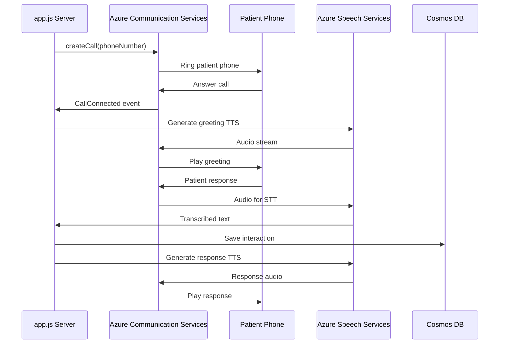
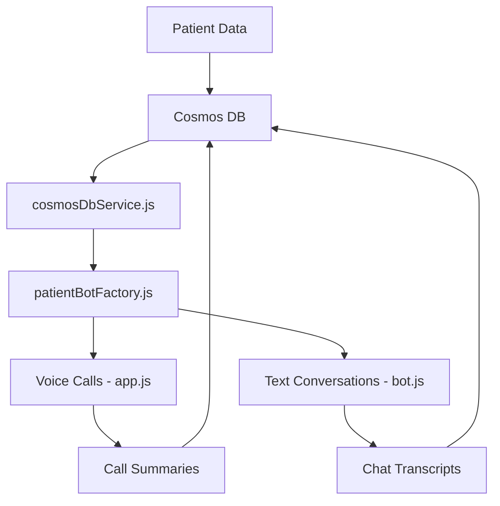

# Development Guide

## 📋 File Structure

```
voice-bot/
├── app.js                    # Voice calling server (ACS)
├── index.js                  # Text bot server (Bot Framework) 
├── bot.js                    # Bot logic for text conversations
├── cosmosDbService.js        # Cosmos DB operations
├── patientBotFactory.js      # Patient data management
├── speechService.js          # Azure Speech Services
├── schedulingPlugin.js       # Appointment scheduling
├── .env                      # Environment configuration
├── .env.example             # Environment template
├── package.json             # Dependencies and scripts
├── testAcsCall.js           # Voice calling test script
├── setupTestPatients.js     # Patient data setup
├── showPatientsForCalling.js # Patient listing utility
└── deploymentScripts/       # Azure deployment scripts
```

## 🔧 Development Setup

### Local Development

1. **Environment Setup:**
   ```bash
   # Copy environment template
   cp .env.example .env
   
   # Install dependencies
   npm install
   
   # Start development servers
   npm run start:both
   ```

2. **Dev Tunnel Configuration:**
   ```bash
   # Install Microsoft Dev Tunnel
   winget install Microsoft.DevTunnel
   
   # Create tunnel for voice callbacks
   devtunnel create --allow-anonymous
   devtunnel port create -p 3979
   devtunnel host
   ```

### Code Organization

#### app.js - Voice Calling Server
- **Port**: 3979
- **Purpose**: Handles Azure Communication Services voice calls
- **Key Functions**:
  - `/api/trigger-call` - Initiate outbound calls
  - `/api/callbacks` - ACS webhook events
  - Call state management
  - Speech synthesis and recognition

#### index.js - Text Bot Server  
- **Port**: 3978
- **Purpose**: Bot Framework text conversations
- **Integrations**: Teams, Web Chat, Direct Line

#### cosmosDbService.js - Data Layer
- **Authentication**: Managed Identity or connection string
- **Operations**: CRUD operations for patient data
- **Error Handling**: Retry logic and fallback support

### Testing Workflow

1. **Voice Call Testing:**
   ```bash
   # Test international calling
   node testAcsCall.js
   
   # Check available patients
   node showPatientsForCalling.js
   ```

2. **Text Bot Testing:**
   - Use Bot Framework Emulator
   - Test in Teams or Web Chat
   - Direct Line API testing

3. **Data Integration Testing:**
   ```bash
   # Setup test patients
   node setupTestPatients.js
   ```

## 🏗️ Architecture Details

### Voice Calling Flow



### Data Flow Architecture



## 🧪 Testing Strategies

### Unit Testing
- **Patient Data Operations**: Test CRUD operations
- **Call State Management**: Test memory cleanup
- **Speech Integration**: Mock Azure Speech Services
- **Error Handling**: Test retry logic and fallbacks

### Integration Testing  
- **End-to-End Voice Calls**: Real ACS integration
- **Cosmos DB Operations**: Database connectivity
- **Speech Services**: TTS/STT functionality
- **Webhook Handling**: ACS event processing

### Load Testing
- **Concurrent Calls**: Multiple voice calls simultaneously
- **Database Performance**: High-volume patient data
- **Memory Management**: Long-running call scenarios

## 🔍 Debugging Guide

### Common Issues

1. **"PhoneNumberIdentifier is not a constructor"**
   - **Cause**: Azure SDK version incompatibility
   - **Solution**: Use object format `{kind: 'phoneNumber', phoneNumber: '+1234567890'}`

2. **"ACS callback timeout"**
   - **Cause**: Dev Tunnel not accessible
   - **Solution**: Verify tunnel URL in `ACS_CALLBACK_URL`

3. **"Cosmos DB connection failed"**
   - **Cause**: Authentication or network issues
   - **Solution**: Check connection string and firewall rules

### Debugging Tools

1. **Voice Server Logs:**
   ```bash
   # Start with detailed logging
   DEBUG=* npm run start:voice
   ```

2. **ACS Event Monitoring:**
   - Monitor `/api/callbacks` endpoint
   - Check Azure Communication Services logs
   - Verify webhook delivery

3. **Cosmos DB Debugging:**
   ```javascript
   // Enable detailed logging
   const client = new CosmosClient({
     endpoint: process.env.COSMOS_DB_ENDPOINT,
     key: process.env.COSMOS_DB_KEY,
     connectionPolicy: {
       requestTimeout: 30000
     },
     userAgentSuffix: 'voice-bot-debug'
   });
   ```

### Performance Monitoring

1. **Call Metrics:**
   - Call duration and success rates
   - Speech recognition accuracy
   - Response latency

2. **Database Performance:**
   - Query execution time
   - Connection pool utilization
   - RU consumption

3. **Memory Management:**
   - Call state cleanup effectiveness
   - Memory leak detection
   - Server resource utilization

## 🔧 Code Standards

### TypeScript/JavaScript
- **ES6+ Features**: Use modern JavaScript syntax
- **Async/Await**: Prefer over Promise chains
- **Error Handling**: Always use try-catch blocks
- **Logging**: Structured logging with context

### Azure Integration
- **Managed Identity**: Prefer over connection strings
- **Retry Logic**: Implement exponential backoff
- **Resource Cleanup**: Always cleanup connections
- **Security**: No hardcoded secrets

### Patient Data
- **Privacy**: Follow HIPAA guidelines
- **Validation**: Validate all patient inputs
- **Audit Trail**: Log all data access
- **Encryption**: Encrypt sensitive data

## 🚀 Deployment Pipeline

### Development → Staging → Production

1. **Development:**
   - Local testing with Dev Tunnel
   - Unit and integration tests
   - Code review and approval

2. **Staging:**
   - Azure App Service deployment
   - End-to-end testing
   - Performance validation

3. **Production:**
   - Blue-green deployment
   - Health monitoring
   - Rollback capability

### CI/CD Configuration

```yaml
# Azure DevOps Pipeline Example
trigger:
  branches:
    include:
    - main
    - develop

variables:
  - group: voice-bot-variables

stages:
- stage: Build
  jobs:
  - job: BuildApp
    steps:
    - task: NodeTool@0
      inputs:
        versionSpec: '18.x'
    - script: npm install
    - script: npm run lint
    - script: npm test

- stage: Deploy
  jobs:
  - job: DeployToAzure
    steps:
    - task: AzureWebApp@1
      inputs:
        azureSubscription: 'voice-bot-connection'
        appName: 'voice-bot-app'
        package: '$(Build.ArtifactStagingDirectory)/voice-bot.zip'
```

## 📚 Best Practices

### Security
- **Authentication**: Always use Azure Managed Identity
- **Secrets Management**: Store in Azure Key Vault
- **Network Security**: Use private endpoints when possible
- **Access Control**: Implement RBAC

### Performance
- **Connection Pooling**: Reuse Azure service connections
- **Caching**: Cache frequently accessed patient data
- **Async Operations**: Non-blocking I/O operations
- **Resource Management**: Monitor and optimize RU usage

### Reliability
- **Health Checks**: Implement comprehensive health endpoints
- **Circuit Breakers**: Prevent cascade failures
- **Graceful Degradation**: Fallback to cached data
- **Monitoring**: Real-time alerts and dashboards

### Maintainability
- **Documentation**: Keep README and code comments updated
- **Testing**: Maintain high test coverage
- **Refactoring**: Regular code cleanup and optimization
- **Dependencies**: Keep packages updated and secure

---

**For production deployment, see the main README.md for complete setup instructions.**
