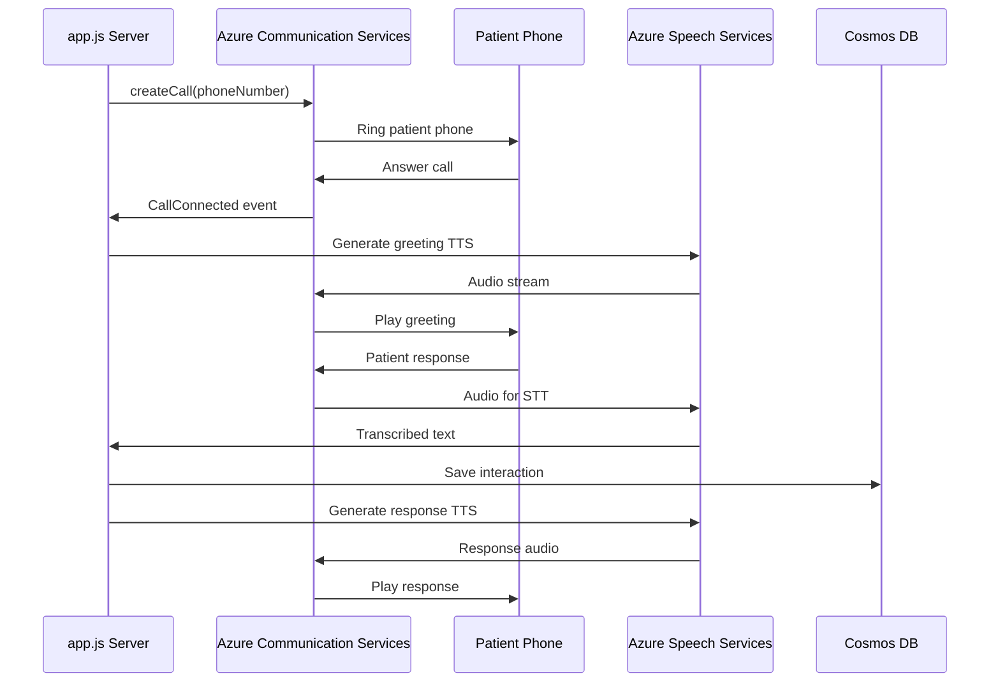
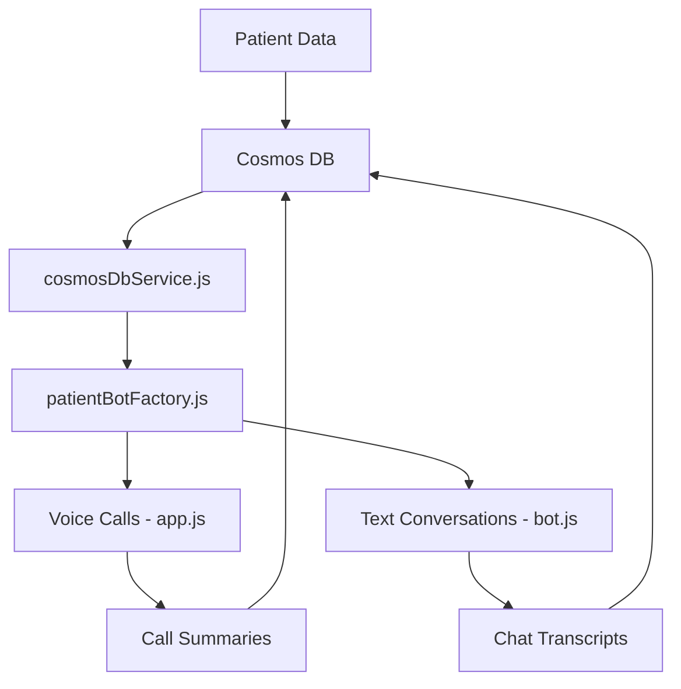

# Development Guide

## 📋 File Structure

```
voice-bot/
├── app.js                    # Voice calling server (ACS) - Primary voice server
├── index.js                  # Text bot server (Bot Framework) 
├── bot.js                    # Bot logic for text conversations
├── cosmosDbService.js        # Cosmos DB operations
├── patientBotFactory.js      # Patient data management
├── schedulingPlugin.js       # Appointment scheduling
├── testAcsCall.js           # Voice calling test script for ACS
├── .env                      # Environment configuration
├── .env.example             # Environment template
├── package.json             # Dependencies and scripts
├── setupTestPatients.js     # Patient data setup
├── showPatientsForCalling.js # Patient listing utility
├── updatePhoneNumbers.js    # Phone number management utility
├── verifyPhoneNumbers.js    # Phone number verification utility
├── importData.js            # Data import utility
└── deploymentScripts/       # Azure deployment scripts
```

**Note**: Recently removed files for cleanup:
- `speechService.js` (functionality integrated into app.js)
- `diagnose.js` and `diagnoseAcs.js` (diagnostic tools no longer needed)
- `index.html` and `local-voice-chat.html` (unused frontend files)
- `startup.cmd` and `startup.sh` (replaced by npm scripts)

## 🔧 Development Setup

### Local Development

1. **Environment Setup:**
   ```bash
   # Copy environment template
   cp .env.example .env
   
   # Install dependencies
   npm install
   
   # Start voice server only (recommended for ACS development)
   npm run start:voice
   # OR start both servers (voice + text bot)
   npm run start:both
   ```

2. **Dev Tunnel Configuration for ACS Callbacks:**
   ```bash
   # Install Microsoft Dev Tunnel
   winget install Microsoft.DevTunnel
   
   # Create tunnel for voice callbacks (port 3979)
   devtunnel create --allow-anonymous
   devtunnel port create -p 3979
   devtunnel host
   
   # Update ACS_CALLBACK_URL in .env with your tunnel URL
   # Example: ACS_CALLBACK_URL="https://your-tunnel-id-3979.inc1.devtunnels.ms/api/callbacks"
   ```

3. **Azure Communication Services Setup:**
   ```bash
   # Required environment variables for ACS:
   ACS_CONNECTION_STRING="endpoint=https://your-acs-resource.communication.azure.com/;accesskey=..."
   ACS_PHONE_NUMBER="+1234567890"  # Your ACS phone number
   ACS_CALLBACK_URL="https://your-tunnel-3979.inc1.devtunnels.ms/api/callbacks"
   
   # Azure Speech Services (for TTS/STT):
   SPEECH_KEY="your-speech-service-key"
   SPEECH_REGION="eastus2"
   SPEECH_ENDPOINT="https://your-speech-resource.cognitiveservices.azure.com/"
   ```

### Code Organization

#### app.js - Voice Calling Server (Primary Focus)

- **Port**: 3979
- **Purpose**: Handles Azure Communication Services voice calls
- **Key Features**:
  - International calling to patients (+919158066045 format)
  - Real-time webhook processing for ACS events
  - Dual event format support (Azure Event Grid + ACS native)
  - Call state management with automatic cleanup
  - Speech synthesis integration (TTS) 
  - Speech recognition integration (STT)
  - Patient data integration via Cosmos DB

- **Key Endpoints**:
  - `/api/trigger-call` - Initiate outbound calls to patients
  - `/api/callbacks` - ACS webhook events (CallConnected, CallEnded, etc.)
  - `/health` - Health check endpoint

- **Current Status**: 
  - ✅ Call connection working (calls reach target phone)
  - ✅ Webhook event processing working
  - ✅ Dev Tunnel integration working  
  - ⚠️ Speech Services integration requires Azure portal configuration
  - ✅ International calling to India (+91) working

#### index.js - Text Bot Server (Optional)

- **Port**: 3978
- **Purpose**: Bot Framework text conversations
- **Integrations**: Teams, Web Chat, Direct Line
- **Status**: Independent from voice calling functionality

#### cosmosDbService.js - Data Layer
- **Authentication**: Managed Identity or connection string
- **Operations**: CRUD operations for patient data
- **Error Handling**: Retry logic and fallback support

### Testing Workflow

1. **Voice Call Testing (ACS):**
   ```bash
   # Test ACS voice calling with your phone number
   node testAcsCall.js
   
   # Check available patients in database
   node showPatientsForCalling.js
   
   # Update phone numbers for testing
   node updatePhoneNumbers.js
   
   # Verify phone number configurations
   node verifyPhoneNumbers.js
   ```

2. **Text Bot Testing (Optional):**
   - Use Bot Framework Emulator
   - Test in Teams or Web Chat
   - Direct Line API testing

3. **Data Integration Testing:**
   ```bash
   # Setup test patients in Cosmos DB
   node setupTestPatients.js
   
   # Import additional patient data
   node importData.js
   ```

4. **End-to-End ACS Testing Process:**
   - Start voice server: `npm run start:voice` 
   - Start Dev Tunnel on port 3979
   - Run test call: `node testAcsCall.js`
   - Monitor webhook events in server logs
   - Answer call on your phone to test TTS/STT

## 🏗️ Architecture Details

### Voice Calling Flow



### Data Flow Architecture



## 🧪 Testing Strategies

### Unit Testing
- **Patient Data Operations**: Test CRUD operations
- **Call State Management**: Test memory cleanup
- **Speech Integration**: Mock Azure Speech Services
- **Error Handling**: Test retry logic and fallbacks

### Integration Testing  
- **End-to-End Voice Calls**: Real ACS integration
- **Cosmos DB Operations**: Database connectivity
- **Speech Services**: TTS/STT functionality
- **Webhook Handling**: ACS event processing

### Load Testing
- **Concurrent Calls**: Multiple voice calls simultaneously
- **Database Performance**: High-volume patient data
- **Memory Management**: Long-running call scenarios

## 🔍 Debugging Guide

### Common Issues

1. **"Request not allowed when Cognitive Service Configuration not set during call setup"**
   - **Cause**: Speech Services not properly linked to ACS resource
   - **Solution**: 
     - Link Speech Services resource to ACS in Azure portal
     - Verify Speech Services region matches ACS region
     - Check Speech Services permissions and configuration

2. **"PhoneNumberIdentifier is not a constructor"**
   - **Cause**: Azure SDK version incompatibility
   - **Solution**: Use object format `{kind: 'phoneNumber', phoneNumber: '+1234567890'}`

3. **"ACS callback timeout" or Webhook not received**
   - **Cause**: Dev Tunnel not accessible or incorrect callback URL
   - **Solution**: 
     - Verify Dev Tunnel is running: `devtunnel host`
     - Check tunnel URL in `ACS_CALLBACK_URL` environment variable
     - Ensure port 3979 is correctly forwarded

4. **"Call connection failed" or International calling issues**
   - **Cause**: Phone number format or calling permissions
   - **Solution**:
     - Use international format: `+919158066045` (include country code)
     - Verify ACS resource has international calling enabled
     - Check outbound calling plan on ACS resource

5. **"Cosmos DB connection failed"**
   - **Cause**: Authentication or network issues
   - **Solution**: Check connection string and firewall rules

### Debugging Tools

1. **Voice Server Logs:**
   ```bash
   # Start with detailed logging
   DEBUG=* npm run start:voice
   ```

2. **ACS Event Monitoring:**
   - Monitor `/api/callbacks` endpoint
   - Check Azure Communication Services logs
   - Verify webhook delivery

3. **Cosmos DB Debugging:**
   ```javascript
   // Enable detailed logging
   const client = new CosmosClient({
     endpoint: process.env.COSMOS_DB_ENDPOINT,
     key: process.env.COSMOS_DB_KEY,
     connectionPolicy: {
       requestTimeout: 30000
     },
     userAgentSuffix: 'voice-bot-debug'
   });
   ```

### Performance Monitoring

1. **Call Metrics:**
   - Call duration and success rates
   - Speech recognition accuracy
   - Response latency

2. **Database Performance:**
   - Query execution time
   - Connection pool utilization
   - RU consumption

3. **Memory Management:**
   - Call state cleanup effectiveness
   - Memory leak detection
   - Server resource utilization

## 🔧 Code Standards

### TypeScript/JavaScript
- **ES6+ Features**: Use modern JavaScript syntax
- **Async/Await**: Prefer over Promise chains
- **Error Handling**: Always use try-catch blocks
- **Logging**: Structured logging with context

### Azure Integration
- **Managed Identity**: Prefer over connection strings
- **Retry Logic**: Implement exponential backoff
- **Resource Cleanup**: Always cleanup connections
- **Security**: No hardcoded secrets

### Patient Data
- **Privacy**: Follow HIPAA guidelines
- **Validation**: Validate all patient inputs
- **Audit Trail**: Log all data access
- **Encryption**: Encrypt sensitive data

## 🚀 Deployment Pipeline

### Development → Staging → Production

1. **Development:**
   - Local testing with Dev Tunnel
   - Unit and integration tests
   - Code review and approval

2. **Staging:**
   - Azure App Service deployment
   - End-to-end testing
   - Performance validation

3. **Production:**
   - Blue-green deployment
   - Health monitoring
   - Rollback capability

### CI/CD Configuration

```yaml
# Azure DevOps Pipeline Example
trigger:
  branches:
    include:
    - main
    - develop

variables:
  - group: voice-bot-variables

stages:
- stage: Build
  jobs:
  - job: BuildApp
    steps:
    - task: NodeTool@0
      inputs:
        versionSpec: '18.x'
    - script: npm install
    - script: npm run lint
    - script: npm test

- stage: Deploy
  jobs:
  - job: DeployToAzure
    steps:
    - task: AzureWebApp@1
      inputs:
        azureSubscription: 'voice-bot-connection'
        appName: 'voice-bot-app'
        package: '$(Build.ArtifactStagingDirectory)/voice-bot.zip'
```

## 📚 Best Practices

### Security
- **Authentication**: Always use Azure Managed Identity
- **Secrets Management**: Store in Azure Key Vault
- **Network Security**: Use private endpoints when possible
- **Access Control**: Implement RBAC

### Performance
- **Connection Pooling**: Reuse Azure service connections
- **Caching**: Cache frequently accessed patient data
- **Async Operations**: Non-blocking I/O operations
- **Resource Management**: Monitor and optimize RU usage

### Reliability
- **Health Checks**: Implement comprehensive health endpoints
- **Circuit Breakers**: Prevent cascade failures
- **Graceful Degradation**: Fallback to cached data
- **Monitoring**: Real-time alerts and dashboards

### Maintainability
- **Documentation**: Keep README and code comments updated
- **Testing**: Maintain high test coverage
- **Refactoring**: Regular code cleanup and optimization
- **Dependencies**: Keep packages updated and secure

---

**For production deployment, see the main README.md for complete setup instructions.**
